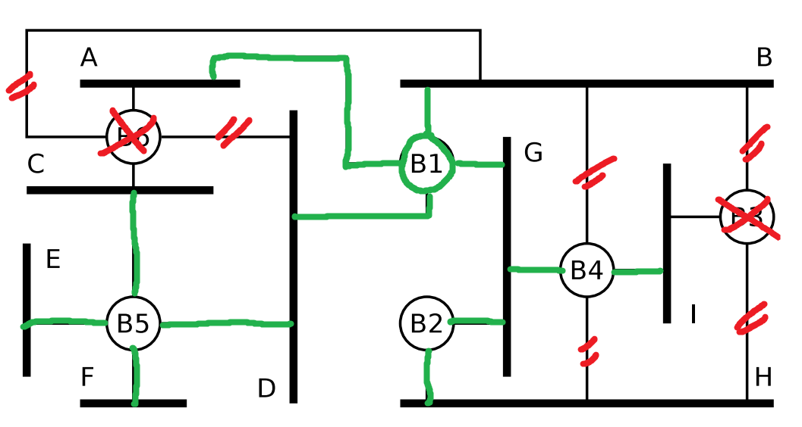

# Exercise 3

## 1 Byte Shuffeling

1. 16 16 01 99 98 97 96 95 02 __A1 A2 A3 A4 A5__ 03 A0 B7
2. 16 16 01 99 98 97 96 95 02 __05 04 10 03 02 01__ 03 76 35
3. 16 16 01 99 98 97 96 95 02 __10 03 10 10 10 03__ 03 92 55
4. 16 16 01 99 98 97 96 95 02 __10 10 10 10 10 03 01 02 A1__ 03 99 B2

## 2 Bit Stuffing

1. 011111010 10100111 111110000 11110010 100111110 101111101 11100101
2. 001111101 01110001 111100011 111011100 10101010 11001111 101100001
3. 111110111 1101111101 111101111 1011111011 1110111110 111110111 1101111101

## 3 Addressing in the Data Link Layer

1. [...] physical network addresses
2. MAC addresses
3. IEEE 802 Networks
4. Changing the MAC address to an address of another system via software

## 4 Bridges and Switches

1. Bridges connect different devices together with ports
2. If a bride has > 2 ports, its called a switch
3. learning bridges remember which device lies on which port, and stores this information inside a forwarding table
4. ^^
5. An entry is created.
6. Because loops can duplicate frames and cause performance issues
7. Spanning tree Protocol: It creates a port hirachy
8. A spanning tee is a connection between notes without loops
9. The bridge with the highest priority is the root

## 5

## 6

1. CN's need protocols for MAC, because the multiple components of the CN need to be coordinated, or else they will cause collisions
2.  + In non-deterministic MAC, devices compe for the media access, and upcoming collisions need to be handled.
    + In deterministic MAC, media access is allocated in advance, completely avoiding crashes.
3. Ethernet is __deterministic__.
4. WLAN is __non-deterministic__.
5. Because of the physical properties, CSMA/CD is used in Ethernet, because collisions are easily detectable over the Physical Signal. WLAN however has a hard time recognising Collissions, which is why it uses CSMA/CA, which is more collision-avoidance (CA) then collision-detecting (CD)
6. Because in modern CN's, most devices have their own switch, completely avoiding Collisions.
7. There needs to be a listener, who listens after sending data, and there needs to be multiple devices.
8. When the Network is know for causing less collisions
9. The ACK (Acknowledgement frame) is required. It tells the Sender that the frame arrived.

## 7

1. It uses short wavelengths for fast, short-ranged Signals with a very high data rate.
2. RFC 4944, RFC 6282, RFC 2460 and RFC 4291
3. -