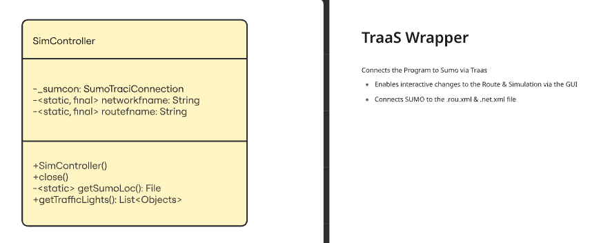
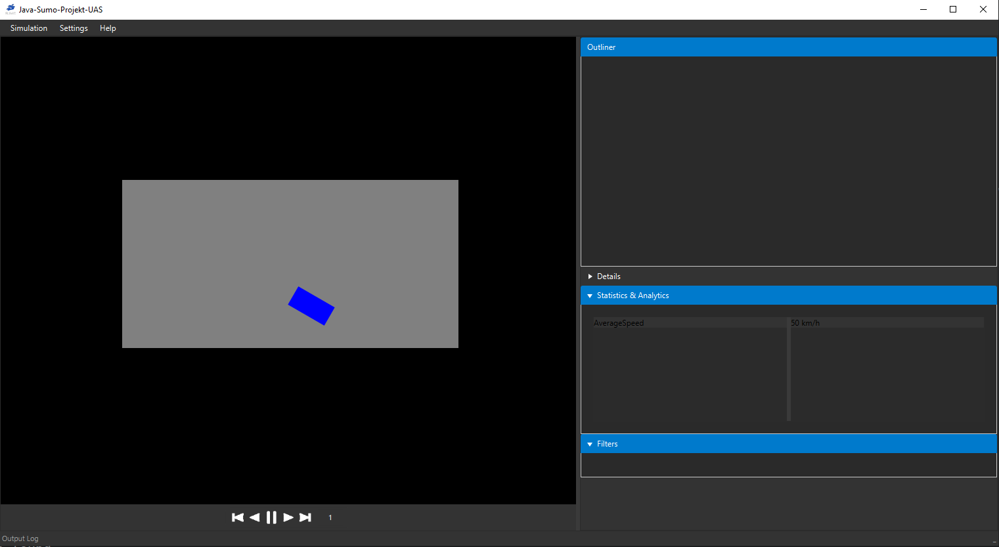
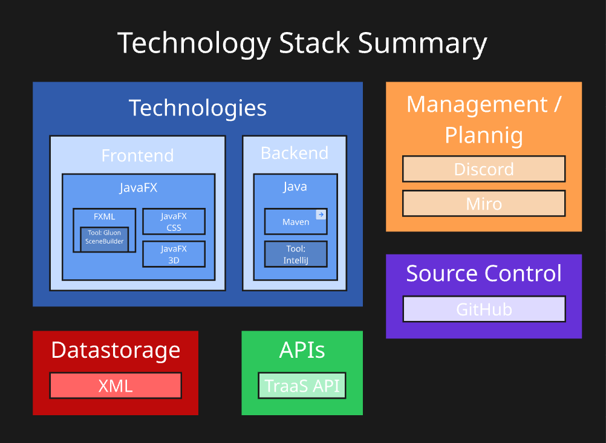
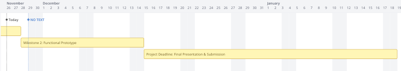

##### Frankfurt UAS

# Group 3 Java Procet WiSe 25/26 Documenation

#### Group Members:

- Luca De Simone (1592157)
- Joel Stark (1591754)
- Leon Chimentchik (1591965)
- David Cornelius (1591981)


## Milestone 1: System Design & Prototype

### 1.1: Purpose

_evaluated upon in_ _1.2::[Project Overview](#project-overview)_

### 1.2: Deliverables

#### Project overview

[_attached in the zip (PDF)_](project_overview.pdf) 

#### Architecure Diagram


#### Class Design for TraaS wrapper



#### GUI Mockups

Instead of doing a mockup, we decided to just implement a base GUI directly using JavaFx. This does the purpose of a Mockup.



#### SUMO Connection Demo

Running the program (view README.md -> Installation) with success will result in an output
that will somewhat look like this:

```
[DEBUG](Main) Programm Start
[DEBUG](api.SimController) SimController invoked
[DEBUG](api.SimController) Normal Execution detected
[DEBUG](api.SimController) sumo.exe found: C:\Program Files (x86)\Eclipse\Sumo\bin\sumo.exe
[DEBUG](api.SimController) C:\Users\Nutzer\Documents\programming scripts\uni\semester3\javp\resources\net.net.xml
[DEBUG](api.SimController) network file found
[DEBUG](api.SimController) C:\Users\Nutzer\Documents\programming scripts\uni\semester3\javp\resources\net.rou.xml
[DEBUG](api.SimController) route file found
TraAS and TraCI4J are deprecated. Please use libtracijni instead, see https://sumo.dlr.de/docs/Libtraci.html.
[DEBUG](api.SimController) SimController startup was successfull
[DEBUG](Main) [J10]
Step #0.00 (1ms ~= 1000.00*RT, ~11000.00UPS, TraCI: 0ms, vehicles TOT 11 ACT 11 BUF 0)    
Step #5.00 (1ms ~= 1000.00*RT, ~22000.00UPS, TraCI: 3ms, vehicles TOT 22 ACT 22 BUF 11)
```

The important part here is `[DEBUG](Main) [J10]` and `Step #0.00 ...` / `Step #5.00 ...`. These are the results of listing all Traffic lights (ID) and doing 5 steps of the simulation, which takes TraCI 3ms to do.

This obviously is only temperorary and for the sake of the Milestone, and will be integrated into the GUI later.

It is also important to note that our `Debug.print()` method is only for dev. debugging, and propper logging will be executed with `Debug.toConsole()`, which out's the message to a console, which can be opened in the GUI via Settings -> Console, which is then saved* after the program is finished.

_*To be implemented_


#### Technology Stack Summary



This includes [Miro](miro.com), which is what these graphics are made with.

### Software Engineering Practices

#### Git Repository Setup

[_*Link to the Git Repository\*_](https://github.com/Spaceglidemasta/Java-Sumo-Projekt-UAS)

This repository includes the README and the initial commit, together with other 128 commits, which were made along the way of this project.

It is also important to note that everyone except Luca uses their UAS email for the github account, with Luca using his private GitHub account, ["Spaceglidemasta"](github.com/Spaceglidemasta).

#### Time plan



We aim to implement requested features distributed evenly over the given timespan.

#### Team Roles

- __Source Control & GitHub:__ Luca, Joel
- __Management & Documentation:__ David, Leon

- __TraaS Wrapper / Sumo Connection:__ Luca
- __GUI:__ Joel
- __Debugging & Logging__: Leon
- __Project Structure & Maven__: David
- __Network and Routes__: Leon, David