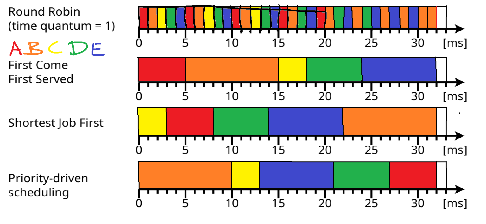

# Exercise 7
## 2 Scheduling Strategies

### 1
The idle process is asigned to the CPU, if the CPU does not have a process in the state `ready` that can be assigned to it. To the keep the CPU assigned to something, it get an _idle process_.
### 2, 3 & 4
#### Non-Preemptive Scheduling:
A process will run until its completed, or until it yields. The problem with this is, that the process may occupy the CPU as long as it wants.
#### Preemptive Scheduling:
The CPU may be removed from a process to give it to another process with a higher order. This will cause higher overhead.

### 5
In order to minimize Waiting Time and therefore also Runtime, the scheduler may give each process a `priotrity`, which determines in which order the processes are to be executed & yieled / (re-)assigned.

This priority may change dynamically, based on the other factors. This is called __multilevel feedback scheduling__.

### 6
+ First Come First Served (only formal, not in practice)
+ Round Robin with time quantum (finite)
+ High Respone Ratio Next

### 7
+ Longest Remaining Time First
+ Round Robin with finite Time quantum
+ Shortest Remaining Time First
+ Multilevel feedback scheduling

### 8
+ Shortest Remaining Time First
+ Longest Remaining Time First
+ Shortest Job First
+ Longest Job First

## 3 Scheduling




| Runtime        | A   | B   | C   | D   | E   |
| -------------- | --- | --- | --- | --- | --- |
| RR             | 20  | 32  | 13  | 25  | 30  |
| FCFS           | 5   | 15  | 18  | 24  | 32  |
| SJF            | 8   | 32  | 3   | 14  | 22  |
| Pd. Scheduling | 32  | 10  | 13  | 27  | 21  |

#### Average Runtime: 

```math
t_{avg} = \frac{20 + 32 + ...  + 21}{5 * 4} = 19.8
```


| Waiting Time   | A   | B   | C   | D   | E   |
| -------------- | --- | --- | --- | --- | --- |
| RR             | 15  | 22  | 10  | 19  | 22  |
| FCFS           | 0   | 5   | 15  | 18  | 24  |
| SJF            | 3   | 22  | 0   | 8   | 14  |
| Pd. Scheduling | 27  | 0   | 10  | 21  | 13  |

#### Average Waiting Time

```math
t_{avg} = \frac{15 + 22 + ...  + 13}{5 * 4} = 13.4
```