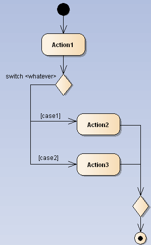

# Exercise 6

## 1

1. Transaction Systems
2. Video Games
3. API's

## 2

->

## 3

With a "Decision branch":

## 4

- A merge is required.
- The rest is still possible

## 5

- The state "Transaction" in a Transaction activity when using an
ATM at the bank. The compisite state "Transaction" consists of 
multiple sub-states where things like verification, encoding and
transactioning the money is done.

## 6
- (Defining the internal structure of systems)
- Modeling the dynamic interactions and processes within a system 