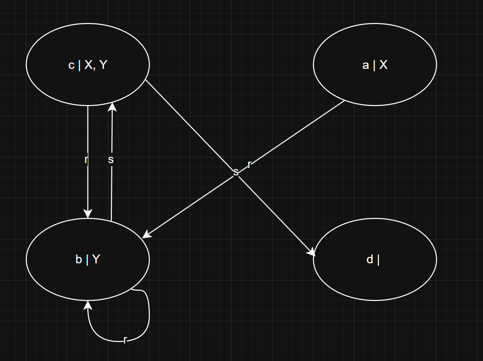

# Exercies: Knowledge Representation
## Q1
### a)
Everyone who has atleast one child which is male
### b)
Everyone who has atleast one child which has any sex
### c)
Everyone who has atleast one child which has no sex (not non-binary; non-sensical)
### d)
Everyone who where all children are male
### e)
Everyone who where all children have any sex
### f)
Everyone who where all children have no sex (not non-binary; non-sensical)

## Q2
### a)
#### I
Atleast one $a^I$ which has the role $r$ and is part of the empty class -> No one

$$(\exists r.\bot)^I = \emptyset$$

#### II
All $a^I$ which have the role $r$ and are part of any class

### b)

No

### c)

yes

### d)

yes, its tautologic

## Q3

### a)

yes, example:

$\Delta =\{a, b\}$

$r = \{(a,b), (b,b)\}$

$A = \{a, b\}$

$B = \{b\}$

### b)

yes, example:

$\Delta =\{a\}$

$r = \{(a,a)\}$

$s = \{(a,a)\}$

$A = \{a\}$

$B = \{a\}$;

$\Rightarrow T = \{...\}$

$\Rightarrow T = \{true, true\}$

## Q4

## Q5

### a)

$\{a, b, c\}$

### b)

$\{b, c\}$

### c)

$\{\}$

### d)

$\{a, b, c\}$

### e)

$\{b\}$

### f)

$\{b\}$

### g)

$\{\}$

### h)

$\{a, b, c, d\}$

### i)

$\{a, b, c, d\}$

### j)

$\{a, b, c, d\}$

### k)

$\{d\}$

### l)

$\{a, d\}$

## Q6

### a)

Satisfied:

$Y = \{b, c\}$

$\forall r.Y = \{a, b, c, d\}$

$\{b, c\} \subseteq \{a, b, c, d\}$

### b)

Not Satisfied:

$\{a, c\} \not\equiv \{b, c\}$

### c)

Not Satisfied:

$\{a, b, c, d\} \nsubseteq \{a, b, c\}$

### d)

Satisfied, trivial

### e)

Satisfied:

$$
\{b, c\} \subseteq \{a, b, c\} \cup \{b\}
$$

