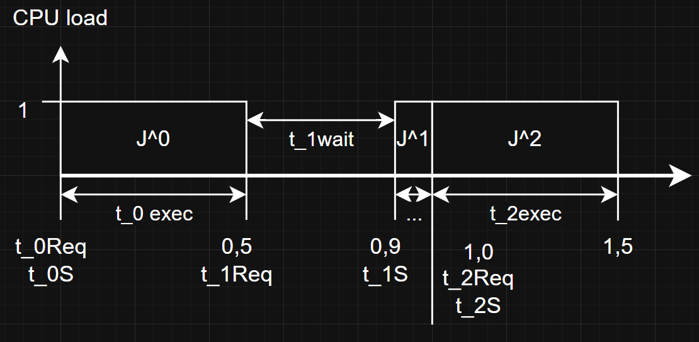
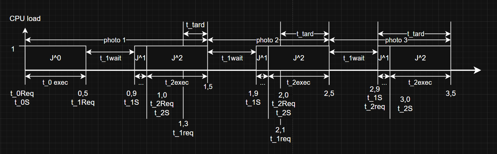
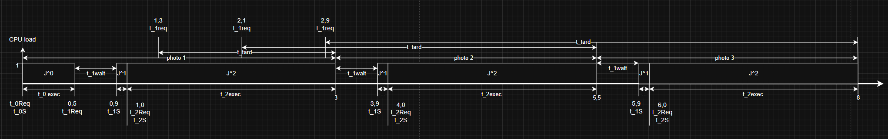

###### Luca De Simone 1592157 31/05/2026
# HW 4: Camera THU

## a) Jobs

Numbers are given in seconds

$$\text{Camera initialization: }J^0 = (0, 0.9)$$
$$\text{Expose photo: }J^1 = (0.9, 0.1)$$
$$\text{Store photo: }J^2 = (1, 0.5)$$

###### The "..." represents "t_1 exec"

## b)
### b1)

$$\text{Camera initialization: }J^0 = (0, 0.9)$$
$$\text{Expose and Store photo: }J^1 = (0.9, 0,6)$$

### b2) & b3)

$t_{rate\_min} = 1 \div (t_{exec} + t_{wait}) = 1 \div 1,5s \approx \underline{0,67s^{-1}}$

$t_{rate\_max} = 1 \div t_{exec} = 1 \div 1s = \underline{1s^{-1}}$

### b4) & b5)

$t_{per} = 0,8s$

$t_{exec} = 1s$

$t_{exec} > t_{per} \Rightarrow \text{tardiness over 0}$

Tardiness per pictures taken $x$:

$t_{tard}(x) = (t_{exec} - t_{per}) x$

###### All dead- & completion times are implied to be at the end of each execution time

## c)

$t_{rate\_min} = 1 \div (t_{exec} + t_{wait}) = 1 \div 3s \approx \underline{0,33s^{-1}}$

$t_{rate\_max} = 1 \div t_{exec} = 1 \div 2,5s = \underline{0,4s^{-1}}$