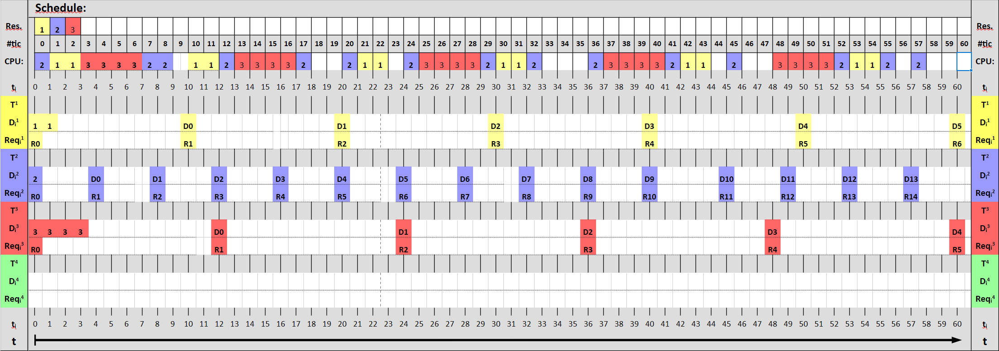
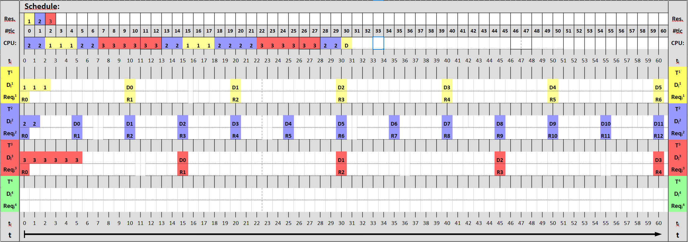
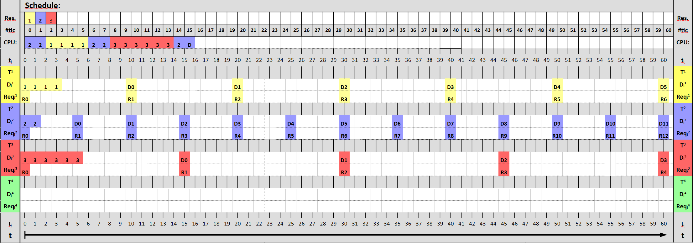
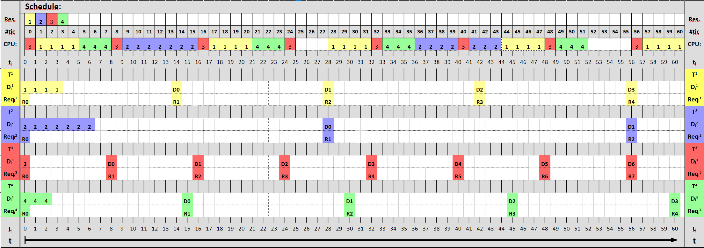
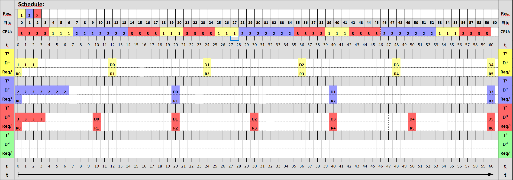
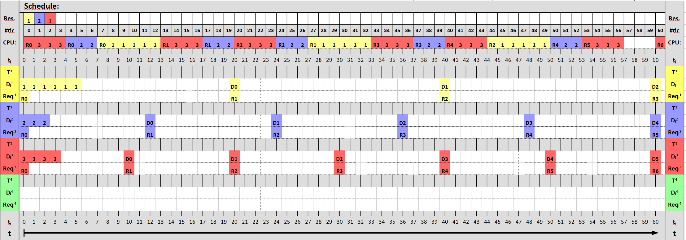

###### Luca De Simone 1592157
# Homework 6
Stellen bei denen die deadline abläuft sind mit "D" makiert.
## Exercise 1 Earliest Due Date (EDD)
### Taskset: { T1 (2, 10); T2 (1, 4); T3 (4, 12) }

### Taskset: { T1 (3, 10); T2 (2, 5); T3 (6, 15) }

### Taskset: { T1 (4, 10); T2 (2, 5); T3 (6, 15) }

### Taskset: { T1 (4, 14); T2 (7, 24); T3 (1, 8); T4(3, 15)}

### Taskset: { T1 (3, 12); T2 (7, 20); T3 (4, 10)}

### Taskset: { T1 (6, 20); T2 (3, 12); T3 (4, 10)}
