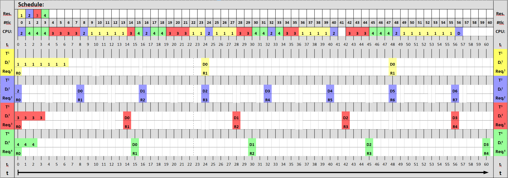
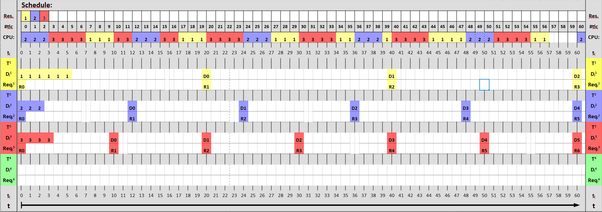
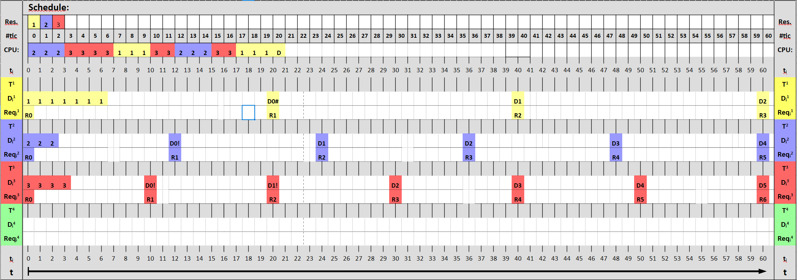
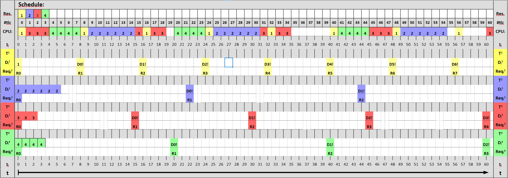
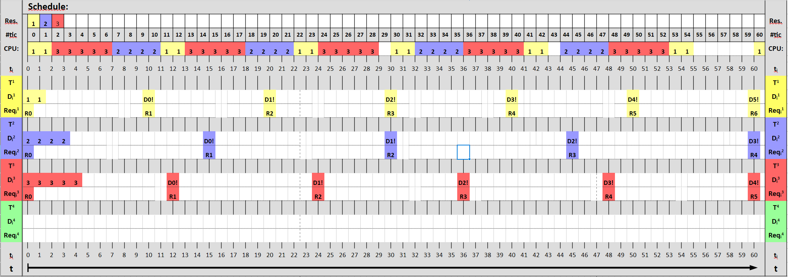
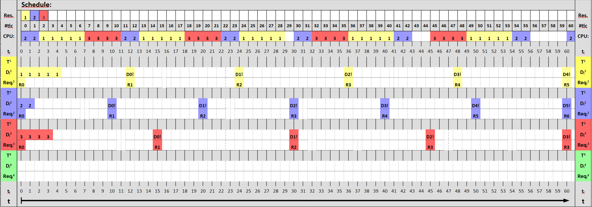

###### Luca De Simone 1592157
# Homework 7
Stellen bei denen die deadline abläuft sind mit "D" makiert.
## Exercise 1 Rate Monotonic Scheduling
### Taskset: { T1 (7, 24); T2 (1, 8); T3 (4, 14); T4 (3, 15) }

### Taskset: { T1 (6, 20); T2 (3, 12); T3 (4, 10) }

### Taskset: { T1 (7, 20); T2 (3, 12); T3 (4, 10) }

### Load

### Schedulability tests

## Exercise 2 Earliest Deadline First (EDF)
### Taskset: { T1 (1, 8); T2 (6, 22); T3 (3, 15); T4(4, 20)}

### Taskset: { T1 (2, 10); T2 (4, 15); T3 (5, 12)}

### Taskset: { T1 (5, 12); T2 (2, 10); T3 (4, 15)}

### Schedulability tests