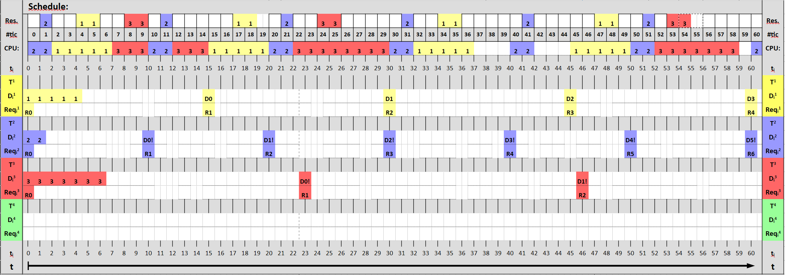
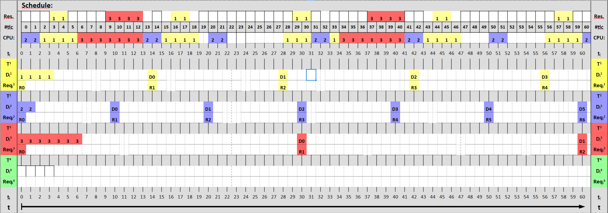

# HW 8: RMS with Resources

## Schedulability tests
### a)

+ $T_1 =$ (5; 15; 2; 2)
+ $T_2 =$ (2; 10; 1; 1)
+ $T_3 =$ (7; 23; 1; 2)

$$
T_1 = \frac{5}{15} = \frac{1}{3}
$$

$$
T_2 = \frac{2}{10} = \frac{1}{5}
$$

$$
T_3 = \frac{7}{23}
$$

$$
T_* = \frac{1}{3} + \frac{1}{5} + \frac{7}{23} \approx 0.8377
$$

$$
U \leq 3(2^{1/3} - 1)
$$

$$
U \leq 0.7798
$$

$$
0.8377 \nleq 0.7798
$$

$\Rightarrow$ Not confirmed to be Schedulable

### b)

+ $T_1 =$ (4; 14; 1; 2)
+ $T_2 =$ (2; 10; 0; 0)
+ $T_3 =$ (7; 30; 3; 4)

$$
T_1 = \frac{4}{14} = \frac{2}{7}
$$

$$
T_2 = \frac{2}{10} = \frac{1}{5}
$$

$$
T_3 = \frac{7}{30}
$$

$$
T_* = \frac{2}{7} + \frac{1}{5} + \frac{7}{30} \approx 0.7190
$$

$$
U \leq 3(2^{1/3} - 1)
$$

$$
0.7190 \leq 0.7798
$$

$\Rightarrow$ Definitly Schedulable

## Schedules

###### Bitte denken Sie sich überall die "!" hinter die Deadlines dazu, die habe ich vergessen. Die Deadlines konntent überall getroffen werden, wenn auch teilweise sehr knapp (A tic 22).

### Table A

### Table B

