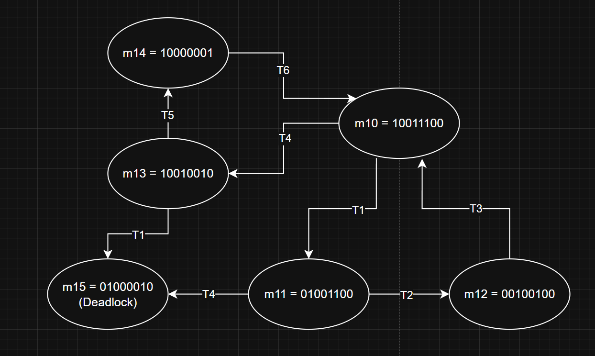
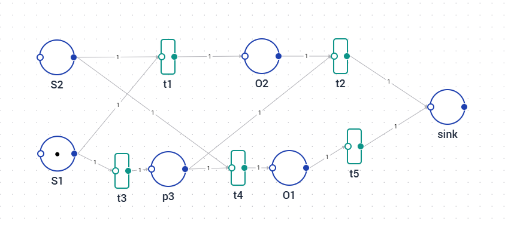

###### Luca De Simone 1592157

# HW 9: Petri Nets 1
## 1

Because of the Deadlock $m_{15}$, the system is __not alive__.

It is however __safe__, because no node ever holds more then 1 Token.

## 2

###### Example resource with small package

If the package is only in S1 (short package), only t3 will fire. This way P3 is 1 until S2 is fired by the light sensor. Then, t4 will fire and not t1. This way, O2 stays 0 and O1 becomes 1. After this, the left out Resource in O1 will go into the sink.

If the package activates both S1 and S2 at the same time (big package), t1 __and__ t3 will fire. This will cause O2 and p3 to become 1. After this, only t2 fires and both resources from O2 and p3 will end up in the sink.

If neither S1 or S2 are fired, both O1 and O2 stay 0.