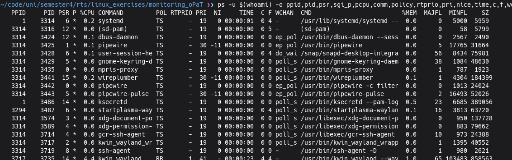
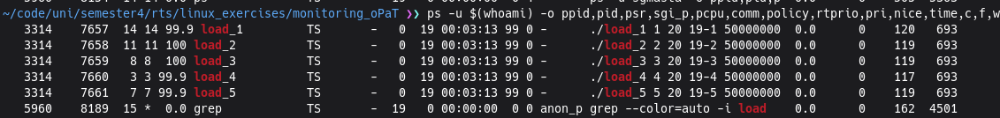
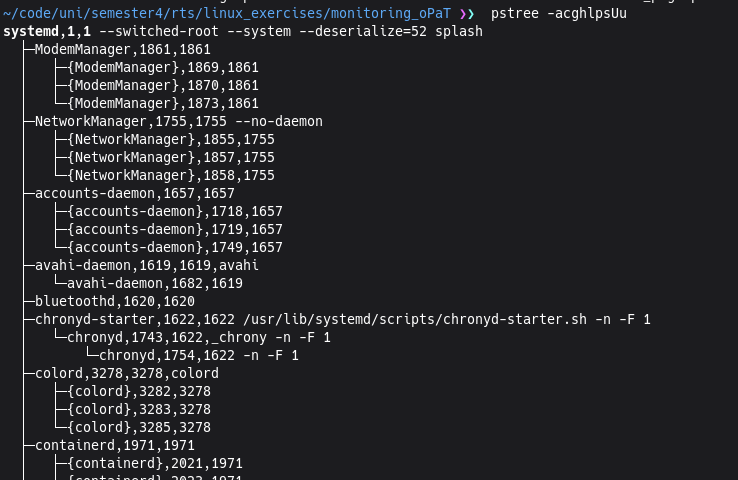
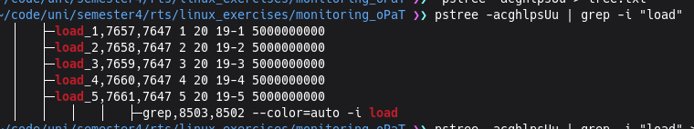
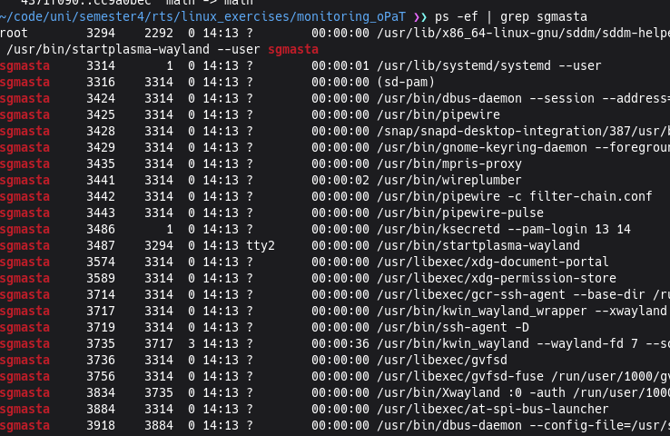
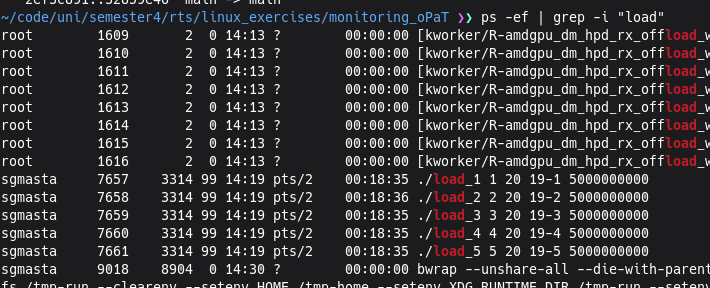

# Monitoring of Processes and Threads
## Exercises 1
### a)

| Flag   | Meaning                                                  |
| ------ | -------------------------------------------------------- |
| -u     | user                                                     |
| -o     | Display the following columns                            |
| PPID   | parent process id                                        |
| PID    | process id                                               |
| PSR    | designatedCPU core number                                |
| SGI_P  | cpu core its actually running on rn                      |
| %CPU   | cpu core usage in %                                      |
| COMM   | full command without args                                |
| POLICY | scheduling policy                                        |
| RTPRIO | Real time priority                                       |
| PRI    | Prio of the process                                      |
| NICE   | niceness                                                 |
| TIME   | used cpu time                                            |
| C      | full cpu usage value                                     |
| F      | process flags (for kernel)                               |
| WCHAN  | what sleep function from the kernel the process is using |
| CMD    | full command with args                                   |
| %MEM   | memory usage in %                                        |
| MAJFLT | major page faults                                        |
| MINFLT | minor page faults                                        |
| SZ     | size of process given in pages (4kb)                     |

### b)

| Flag | Meaning                                      |
| ---- | -------------------------------------------- |
| -a   | Shows command line args                      |
| -c   | doesnt truncate branches, you see everything |
| -g   | shows group ids                              |
| -h   | highlights parent process                    |
| -l   | doesnt truncate long strings                 |
| -p   | shosws pids                                  |
| -s   | shows process inheritance                    |
| -U   | uses unicode                                 |
| -u   | shows different users                        |

### c)

The command `ps -ef` shows all processes detailed

### Minor page fault

A minor page fault happens when the program tries to acces a page that is not currently loaded into its virtual address space. When the page is outside this address space but still insdie the RAM, a minor page fault occurs, which means that the system need to update the page table.

This only costs little time and effort compared to a major page fault, where the requested page is not only outside the virtual address space, but also outside the RAM (on a harddisk)

This means that the system needs to swap from the harddrive, which is very time and resource expensive