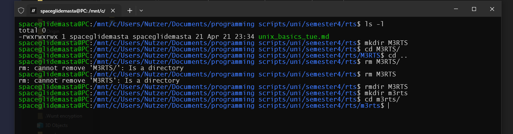

# Unix Basics TUE



```
whoami
```
prints the current user to the terminal
```
groups
```
prints the groups the user is in to the terminal
```
pwd
```
prints the working directory
```
date
```
prints the date
```
echo Hallo
```
prints "Hallo"
```
echo $PATH
```
prints all global enviorement directories
```
export MYLABEL=blabla
```
sets a global enviorement variable / label
```
echo $MYLABEL
```
prints "blabla" to the terminal
```
ps -ef
```
prints all running processes to the terminal
```
ps -ef > ps.out
```
prints all running processes to a file called "ps.out" in the current dir
```
cat ps.out
```
prints the file ps.out to the terminal, conCATinated
```
more ps.out
```
opens the file ps.out in the terminal
```
less ps.out
```
same as more, but only reads a set amount of text
```
head ps.out
```
prints the first 10 lines of ps.out to the terminal
