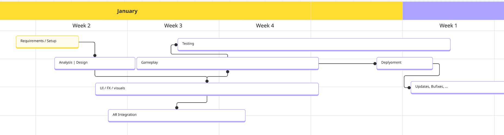

# Exercise 10

## 1

### Milestones
1. (Mid Week 2) Requirements Setup Phase Done: Dependencies / Libraries, Archicetures and Hardware types have been mostly agreed upon, Design Phase Fully starts now

2. (Week 2 end) Early Design and Analysis Phase Done (Basic Class diagrams, Software Architecture, Utilisation of 3rd Party Libraries). Gameplay and concrete UI developement starts.

3. (Beginning Week 5) Gameplay and UI finished. Extensive testing and bugfixing starts.

4. (End Week 5) Deployment of the Product

## 2
Estimated Cost:

4 Employees, 18 $/h, 5 Weeks full time, 25h / week

$25 * 5 * 18 * 4 = 9000 \$$

Product Price: Free with ads / 2$ without Ads

Charging much wouldnt make sense, Tetris on AR Glasses is not a big & wanted project for the marked. I would actually never spent a single penny on this.

## 3
I would "multithread" different parts of the developement which can work well in tandem. This would extend to things like UI, Software Implementation and Testing.

Or in the early phases: Design + Simple UI

In my case, 3 people would work on the software implementation and 1 on UI. Out of the 3 Software guys 1 would probably work the Hardware endpoint

## 4
A simple __iterative approach__:

1. Design the Software
2. Get used to AR integration and the used libraries, build small framework (dont over-abstract, use existing code)
3. Integrate Gameplay into AR
4. Test, Bugfix -> Deploy, repeat

## 5
1. Deploy a half-finished, unpolished Software (bad)
2. Take your time (extend Schedule)
3. Increase Resources (ask for more money from the sponsor)
4. Only finish most critical software parts and realease
5. Rob a bank