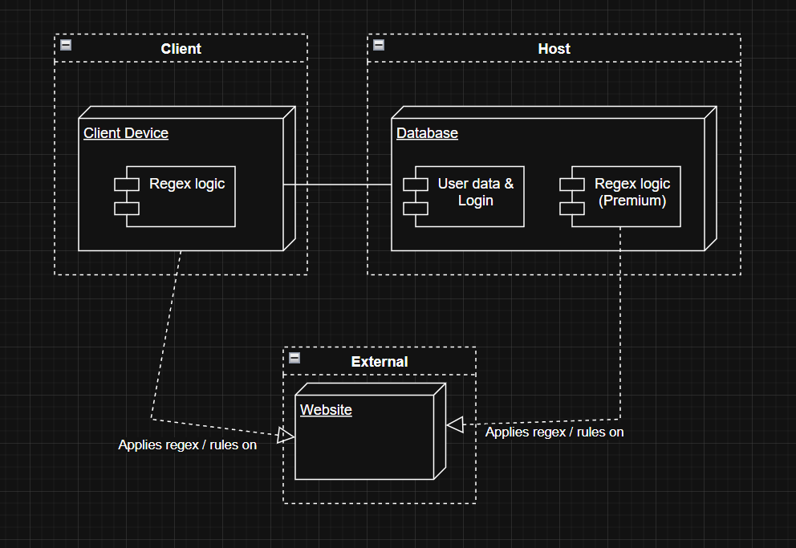

# Exercise 7
## 1

#### Mainframe
The Mainframe model aims to have most if not all computing power on one singular system, which then has very thin input & output sources (terminals), which are used to interact with the mainframe. 

Example: Banks, which used to have everything centralized on the local server, which money input / withdrawl only beeing possible on ATMs which only render UI and send / recieve requests. Almost all computing power was on the local or (inter-)national server.

#### Cloud model
The Cloud model uses multiple, __distributed systems__ to operate. In this model, the service is split over multiple different systems, which oftentimes include devices from the user itself.

Example: Videogames, which store important states like player position (unprecise) and player currency values on the server, but keep ever-changing data like player position (precise), graphical aspects like texures and shaders or view of direction (precise) on each of the clients machines, which also use computing power to support the main server. 

#### Changes
This changed over time so dramatically for multiple reasons. One of them is, that Mainframes where never designed to support hundreds of millions of users. This however, was never an issue for cloud services, as they use computing power from each client.

$\rightarrow$ Better scaling, faster execution, less upfront hardware cost

This got even better for cloud services, when the average device each user used got stronger and stronger computing power over time, which could be used to keep more computing weight on the user, and not on the main server.

Also, because every person has access to multiple independent devices which __could__ connect to cloud services, the demand for said services grew and grew.

## 2

+ JIT Infrastructure: Just like every JIT principle, this allows for fast changes on the fly, without effecting modules of the application that have already been built. (dynamic software, modularity)

+ Very low upfront cost investment. Because cloud based infrastructure relies on hardware from the client / other hosts, onyl a small amount of hardware is needed to start the project.

My implementation wouldve relied on a single, company owned, expensive webserver, which wouldve monitored every website. In this cloud architecture example however, one wouldve put all the dirty regex / comparing work into the hardware of the clients (Smartphones running the application in the background, PCs on startup)

###### We only designed Class Diagrams, not a physical structural design of the application, so its hard to compare it.

## 3

To further use the cloud architecture, I implemented a Premium feature for Users with a payed subscription, which lets them use the Servers power for scanning websites. This is usefull if the user wants to scan alot of data, or cant have their device active at all times.

The Host and with that the whole cloud architecture would be reduntant without this feature, as there is no reason for a server to exist, when the client-side app does all the work.

###### Mistake: The Arrow "Client Device -> Website" should be "Regex logic -> Website"

## 4

On the 7th of June I searched for an explation for why my python virtual enviorement wasnt working with Tensoflow and keras. I searched for an explanation for one hour, bombarding chatgpt with prompts and error logs. 

The problem was the deprecated library requests, which I never noticed or mentioned, but was always visible in the provided error logs.

Despite this effort, it was I who noticed this error and fixed it, while ChatGPT was giving me false effort like "reinstall ur venv for the 3rd time".

The problem here is that the LLM only looked at things I specifcally mentioned, instead of searching for problems in deeper layers of abstraction.
