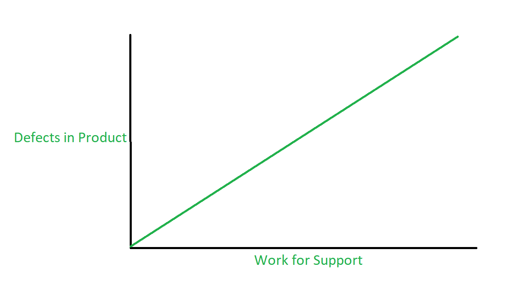

# Exercise 9
## 1
The more defects remain in your software, the more work the product support has to do to fix these problems with their customers.


## 2
### Pro
1. Devs know their program (and its weaknesses) better
2. Someone whos familar with the software architecture can do tests better
3. Lower cost
4. Encourages Responsibility 
5. Faster bug fixes

### Contra
1. Subjective testing
2. No user perspective
3. Less testing expertise
4. Bias towards software behavior
5. Less time for the dev to develop

## 3

Equivalence Classes for website input:

+ TC1: website String has no ".": invalid
+ TC2: website String has one ".": valid
+ TC3: website String has more then one ".": invalid

```Java
@Test
void correctWebsiteInputTest(){
    String tc1 = "googlecom";
    String tc2 = "google.com";
    String tc3 = "google.com.com";

    DataController dc = new DataController();
    User testu = new User("testname", 0);

    assertFalse(
            dc.addWebHook(testu, tc1, 0, ContentCheck_t.CONTENT_SIZE)
    );

    assertTrue(
            dc.addWebHook(testu, tc2, 0, ContentCheck_t.CONTENT_SIZE)
    );

    assertFalse(
            dc.addWebHook(testu, tc3, 0, ContentCheck_t.CONTENT_SIZE)
    );

}
```

## 4

__Regression Testing__ means to test older, working properties of the software after changes are beeing done to the software.

Example: If you fix a login UI bug, you should test if the login via the UI still works for all platforms

Often, "Test Suites" are used, which are collections of tests which ensure that the program as a whole is working correctly. (E.g. you should always test for correct transactions when updating your bank system DB structure)

## 5

__Whitebox__ testing means to test software like / as a developer, meaning you know the code and test it internally. Typically you would use knowladge about code sructure and singular statements inside the code.

__Blackbox__ testing means to test software like / as a User, which means that you dont really touch the code and focus on wheter the Software behaves from the perspective of a user. Typically you would use designated Tester Personal or automatic UI tests, or both.